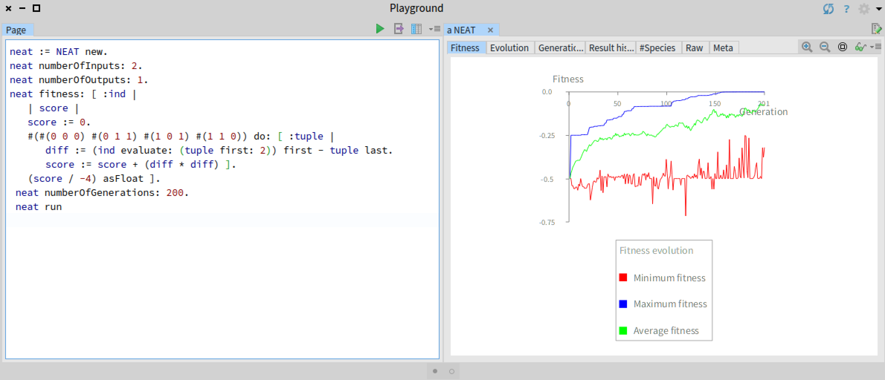
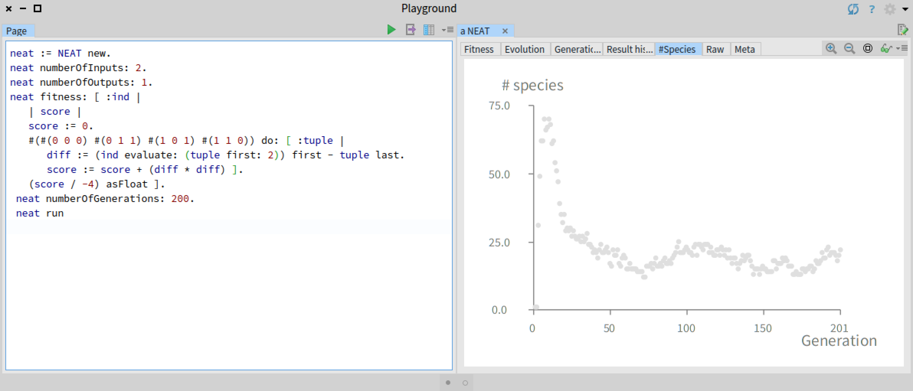
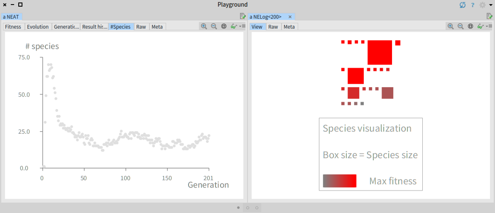
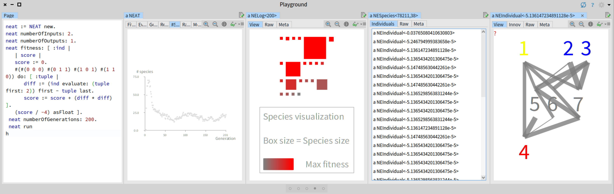

# Neuroevolution and NEAT

[Neuroevolution](https://en.wikipedia.org/wiki/Neuroevolution) is a fantastic area that belongs to artificial intelligence. Neuroevolution is about _evolving_ neural networks to solve a particular problem. Neuroevolution differs from classical deep learning in the way a satisfactory model is obtained. Classical learning techniques for Deep Learning (e.g., backpropagation) are about _learning_, while Neuroevolution is about _evolving_ a model. 

NEAT is maybe the most popular neuroevolution algorithm. A description of NEAT may be found in the paper [Evolving Neural Networks through Augmenting Topologies](http://nn.cs.utexas.edu/downloads/papers/stanley.ec02.pdf).

The content of this GitHub repository is heavily inspired from the book [Agile Artificial Intelligence in Pharo: Implementing Neural Networks, Genetic Algorithms, and Neuroevolution](https://www.apress.com/gp/book/9781484253830).

# NEAT4Pharo

This repository provides an implementation of NEAT for the [Pharo programming language](http://pharo.org). Many implementations of NEAT exist in a wide range of programming languages. The advantages of NEAT4Pharo is to have a relativaly small amount of source code (< 1000 LOC), and it offers interactive visualization to give a better understanding of how the evolution was carried out. 

# Loading NEAT4Pharo

Execute the following script to load the [Roassal2 visualization engine](https://github.com/ObjectProfile/Roassal2) and NEAT4Pharo:

```Smalltalk
Metacello new
    baseline: 'Roassal2';
    repository: 'github://ObjectProfile/Roassal2/src';
    load.
Gofer new
    url: 'github://bergel/NEAT/src';
    package: 'NEAT';
    load.
```

# Example

One of the introductory example in neural network, is to build a neural network that expresses the XOR logical gate. We can do so using NEAT. Consider the following script:

```Smalltalk
neat := NEAT new.
neat numberOfInputs: 2.
neat numberOfOutputs: 1.
neat fitness: [ :ind | 
	| score |
	score := 0.
	#(#(0 0 0) #(0 1 1) #(1 0 1) #(1 1 0)) do: [ :tuple |
		diff := (ind evaluate: (tuple first: 2)) first - tuple last.
		score := score + (diff * diff) ]. 
	(score / -4) asFloat ].
neat numberOfGenerations: 200.
neat run
```

The script configure the NEAT algorithm to handles individual (i.e., neural networks) having two inputs and one output. The XOR logical gates takes two arguments and return one value. So, a neural network with 2 inputs and 1 output is sufficent to express the XOR.

Evaluating the script gives the following output:


We see the curve of the maximum fitness reaches 0. This means that the NEAT algorithm was able to produce through evolution a neural network that express the XOR logical gate. We can veriy this:

```Smalltalk
neat result evaluate: #(0 0).
"Return #(0.0024744051266554854)"

neat result evaluate: #(0 1).
"#(0.9992445715215523)"

neat result evaluate: #(1 0).
"#(0.9901246518281834)"

neat result evaluate: #(1 1).
"#(0.006270828175993032)"
```

In addition to the fitness curve, inspecting the object `neat` gives additional relevant visualizations. For example, the tab `#Species` gives the evolution of the number of species during the generations:



We see that the number of species increases significantly at the begining of the algorithm execution to reach a relatively sable value around 25 species. Clicking on a dot opens the species visualization:



The species visualization represents species. The size of a box is the size of the species, i.e., the number of individual that belongs to the species. The color fading indicate the fitness value of the best individual. Clicking on a species list the individuals that belongs to the species. Clicking on an individual open a visualization of the neural network



# Wanna to chat about it? 

Join the [Pharo discord server](http://pharo.org/community) and join the `#ia` channel. You are also very welcome to post issues to this GitHub repository.


